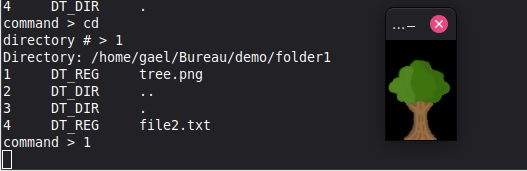

Copyright (c) 2026 Gaël Fortier

## Disclaimer
This project is unstable and likely to crash. 
This project is full of bugs and unexpected behaviors.
This project is meant as an artefact for my portfolio.
Avoid using this program.

## CLI file explorer
Essentially, this is the equivalent of the `cd` and `ls` commands in Linux. It requires SDL2 to run as it is used for opening and rendering images in a window. 
```
DIRECTORY /home/gael/Bureau/demo
1 : file1.txt                                         DT_REG
2 : folder1                                           DT_DIR
3 : ..                                                DT_DIR
4 : .                                                 DT_DIR
option: 
```
There are 3 commands available. When entering the command, only type the command name since if there are more parameters, the program will prompt you for each individual parameters. 

- `set`: opens the directory specified by an absolute path. A second prompt will ask you to specify the absolute path.
```
option: set
path option: /etc
```
```
DIRECTORY /etc
1 : .                                                 DT_DIR
2 : ..                                                DT_DIR
3 : fstab                                             DT_REG
4 : shells                                            DT_REG
5 : mke2fs.conf                                       DT_REG
```
- `cd`: opens a child directory. A second prompt will ask you for the number of the entry associated with the desired child directory.
```
DIRECTORY /home/gael/Bureau/demo
1 : file1.txt                                         DT_REG
2 : folder1                                           DT_DIR
3 : ..                                                DT_DIR
4 : .                                                 DT_DIR
option: 
```
```
option: cd
cd option: 2
```
```
DIRECTORY /home/gael/Bureau/demo/folder1
1 : ..                                                DT_DIR
2 : .                                                 DT_DIR
3 : file2.txt                                         DT_REG
```
- `N`: For N a number between 1 and X, and X being the number of available entries in the directory, the program will attempt to load the Nth entry in the directory as an image and, if successful, open a window displaying the selected image. To close the window, select the window and press on any key.



- `quit`: closes the program.
